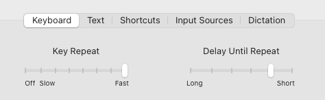

# configs

Dotfiles and script to install programs

## Basic Setup

### 1. Clone this repo via SSH

```sh
git clone git@github.com:fjij/configs.git
```

### 2. Install symlinks

```sh
./install_symlinks
```

### 3. Install Homebrew

**Mac:**

```sh
/bin/bash -c "$(curl -fsSL https://raw.githubusercontent.com/Homebrew/install/HEAD/install.sh)"
```

**Linux:**

```sh
NONINTERACTIVE=1 /bin/bash -c "$(curl -fsSL https://raw.githubusercontent.com/Homebrew/install/HEAD/install.sh)"
```

You will need to run one of the outputted commands to temporarily add brew to
your path.

**Mac:**

```sh
(echo; echo 'eval "$(/opt/homebrew/bin/brew shellenv)"') >> /Users/$USER/.zprofile
eval "$(/opt/homebrew/bin/brew shellenv)"
```

### 4. Install shell programs from Brewfile

```sh
brew bundle install --file ./homebrew/Brewfile
```

### 5. Set fish as default shell

Add fish to the list of valid shells

```sh
echo $(which fish) | sudo tee -a /etc/shells
```

Change default shell

**Mac:**

```sh
chsh -s $(which fish)
```

**Linux:**

```sh
sudo chsh -s $(which fish) $(whoami)
```

You may need to reboot or restart your terminal after this one.

## Configuring CLI Tools

### 1. Use SSH for GitHub CLI

The GitHub CLI clones using HTTPS by default, which isn't my preferred option.
Run this command to make it use SSH instead.

```sh
gh config set git_protocol ssh
```

## GUI Programs Setup

### 1. Install GUI programs from Brewfile

```sh
brew bundle install --file ./homebrew/casks/Brewfile
```

### 2. Configure UnnaturalScrollWheels and MeetingBar

These programs need to be configured to auto-start.

### 3. Configure Yabai

```sh
yabai --start-service
```

You'll have to run this again after enabling accessibility control.

### 3. Install Fonts

### (Optional, Mac Only) Disable font smoothing

If fonts look jagged on external monitors, you can run this to disable font
smoothing. Hopefully it looks better. This probably won't make much of a
difference thought.

```sh
defaults -currentHost write -g AppleFontSmoothing -int 0
sudo reboot
```

## Mac Setup Guide

### 1. Increase Key Repeat

In keyboard settings, update key repeat and delay to the following values:



### 2. Rebind Caps Lock to ESC

Also in the keyboard settings, this can be done by clicking "Modifier Keys...".
